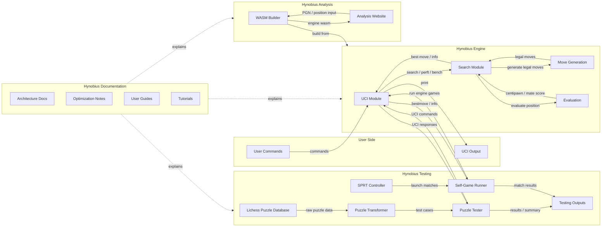

# Project Structure

```mermaid
flowchart LR

%% =========================================================
%% User Side
%% =========================================================
subgraph UserSide["User Side"]
    user_input["User Commands"]
    uci_output["UCI Output"]
end

%% =========================================================
%% Hynobius Engine
%% =========================================================
subgraph Engine["Hynobius Engine"]
    direction TB

    uci["UCI Module"]
    search["Search Module"]
    movegen["Move Generation"]
    eval["Evaluation"]

    uci -->|"search / perft / bench"| search
    search -->|"generate legal moves"| movegen
    movegen -->|"legal moves"| search
    search -->|"evaluate position"| eval
    eval -->|"centipawn / mate score"| search
    search -->|"best move / info"| uci
end

%% =========================================================
%% Testing System
%% =========================================================
subgraph Testing["Hynobius Testing"]
    direction TB

    puzzle["Lichess Puzzle Database"]
    puzzle_trans["Puzzle Transformer"]
    puzzle_tester["Puzzle Tester"]

    sprt["SPRT Controller"]
    selfgame["Self-Game Runner"]

    testing_output["Testing Outputs"]

    puzzle -->|"raw puzzle data"| puzzle_trans
    puzzle_trans -->|"test cases"| puzzle_tester
    puzzle_tester -->|"results / summary"| testing_output

    sprt -->|"launch matches"| selfgame
    selfgame -->|"match results"| testing_output
end

%% =========================================================
%% Analysis Website
%% =========================================================
subgraph Analysis["Hynobius Analysis"]
    direction TB

    wasm["WASM Builder"]
    web["Analysis Website"]

    wasm -->|"engine wasm"| web
end

%% =========================================================
%% Documentation
%% =========================================================
subgraph Documentation["Hynobius Documentation"]
    direction TB

    arch["Architecture Docs"]
    opti["Optimization Notes"]
    guide["User Guides"]
    tuto["Tutorials"]
end

%% =========================================================
%% Cross-system Flow
%% =========================================================
user_input -->|"commands"| uci
uci -->|"print"| uci_output

puzzle_tester -->|"UCI commands"| uci
uci -->|"UCI responses"| puzzle_tester

selfgame -->|"run engine games"| uci
uci -->|"bestmove / info"| selfgame

wasm -->|"build from"| Engine
web -->|"PGN / position input"| wasm

Documentation -.->|"explains"| Engine
Documentation -.->|"explains"| Testing
Documentation -.->|"explains"| Analysis
```
