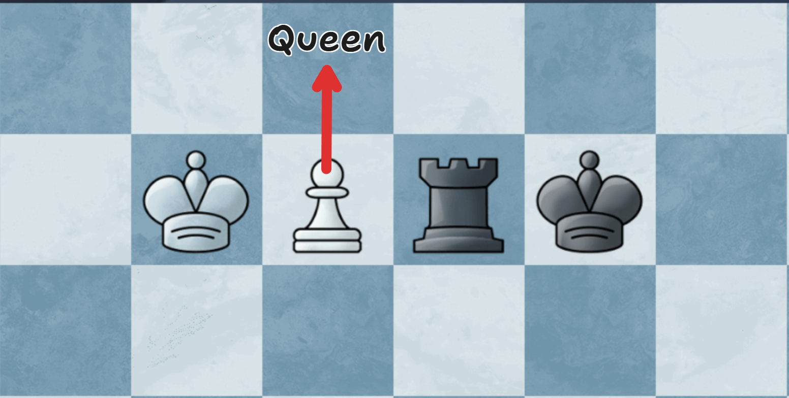
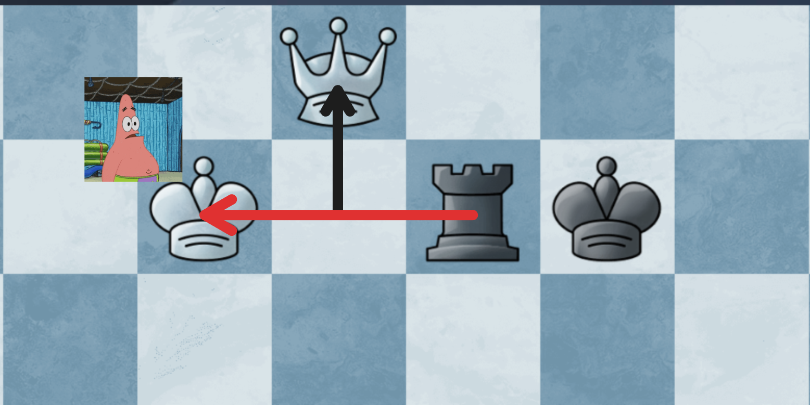
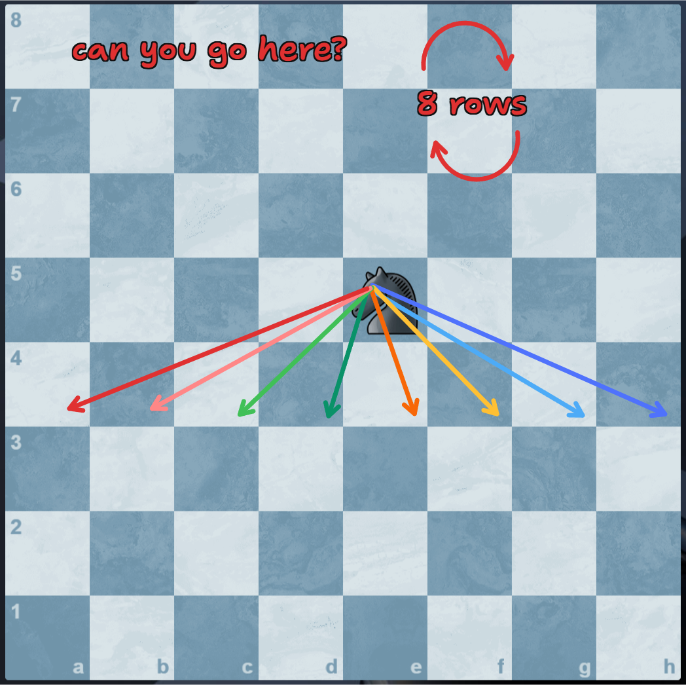
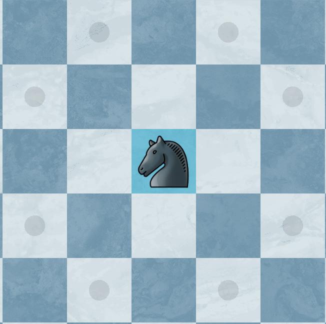
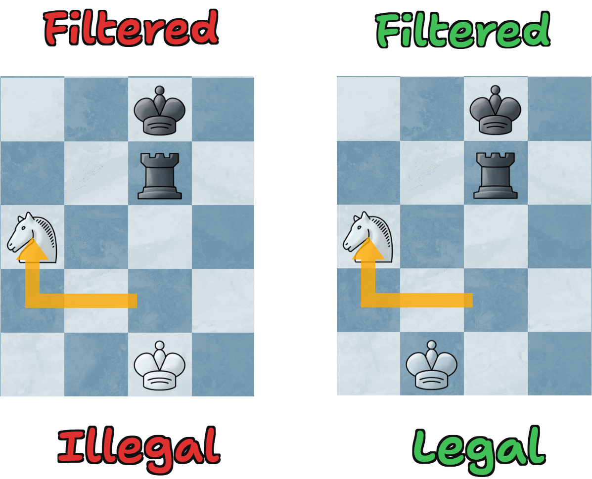
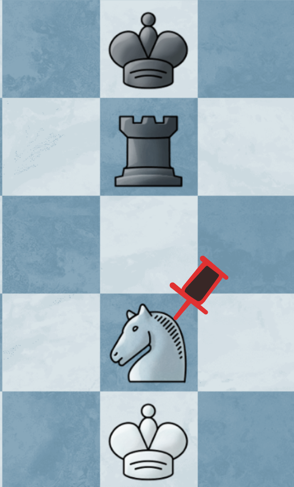
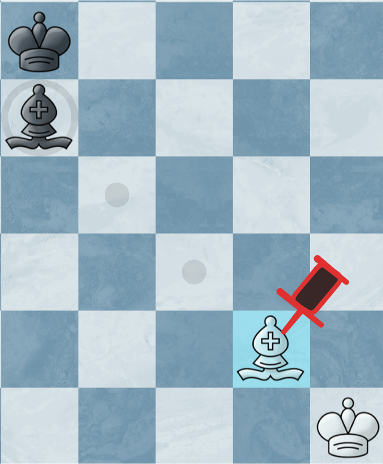
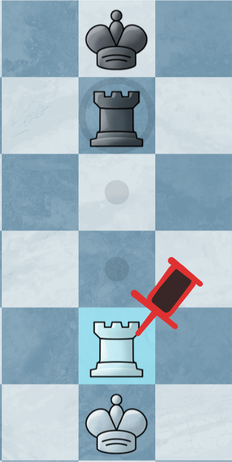

# Move Generator

## Describe in One Sentence

A move generator is responsible for generating every possible move from a position. It is one of the most basic and important parts of a chess engine.

---

## Introduction

> Please read [Chess Engine](./engine_introduce.md) first before continuing.

Move generator is a critical component of an engine. It is responsible for generating every possible move from a position. This "function" may be called millions or billions of times while the engine is searching.

---

## Why Move Generation Must Be Fast

A chess engine search grows very quickly.

If one position has about 35 legal moves, then looking only 1 move ahead gives about 35 positions. Looking 2 moves ahead gives about:

$35 \times 35 = 1225$ positions

Looking 3 moves ahead gives about:

$35 \times 35 \times 35 = 42875$ positions

This number grows exponentially fast.

Because of this, even a small improvement in move generation speed can make the engine search much more deeply.

---

## What Is a Move?

To humans, a move looks simple:

```text
e2e4
```

This means a piece moves from `e2` to `e4`.

But inside a chess engine, a move usually needs more information:

1. The starting square.
2. The target square.
3. The moving piece.
4. The captured piece, if there is one.
5. Special move information, such as promotion, castling, or en passant.

For example, `e7e8q` means a pawn moves from `e7` to `e8` and promotes to a queen.

The move generator's job is to create a list of these moves.

---

## A Legal Move

A legal move must satisfy two conditions:

1. The piece must move according to chess rules.
2. After the move, our king must not be in check.

So, an illegal move may look like this:



We can't promote the pawn, because...



And the pawn is thus called a **"pinned piece"** because it is pinned and it can't move.

---

## Implementation 1: Brute-Force / Exhaustive Search

How can we produce a "move"? There is a simple idea:

> For every piece:
> Try **every destination square**.
> If the piece can move there:
> > Make the move.
> > **Check if our king is safe**.
> > If safe, keep the move.
> > Undo the move.



This implementation is easy to understand, but it is **TOO SLOW**.

Why? Take a knight for example:



It can only move to these dark dotted squares.

So, if we enumerate only these squares, we can reduce from enumerating $64$ squares to only $8$ squares, thus:

$$\frac{8}{64} = 0.125$$

For a knight move, we can reduce about $90\%$ of operations, which is much faster.

---

## Implementation 2: Pseudo-Legal Move Generation

By only enumerating possible possible squares a piece can move to, it can reduce a lot of operations and make searching faster.

However, here comes a problem.

> If we **move a pinned piece**, how can the engine know that it is **illegal**?

That's why we introduce the **"pseudo-legal move system"**. A pseudo-legal move means:

> A move that **follows the piece movement rules**,but may still **leave the king in attack (check)**.

By **generating pseudo-legal moves** and **filtering** them by making actual moves, this system can be much faster than the brute-force one.



However, it is still **TOO SLOW** for top-level engines.

Why? It is because when making real moves, **it takes time**, and top engines want to remove this waste of time, thus a system called **"Pinned Piece Awareness"** is created.

---

## Implementation 3: Pinned Piece Awareness Move Generation

Before generating actual moves, the engine will check for **pinned pieces**. These pieces can't move exactly like others, because they are **restricted to move only along the line of the pin**.

For example:



a pinned knight can't move.



a pinned bishop can only move diagonally.



a pinned rook can only move along the line of the pin.

Once the engine marked these pinned pieces, it can generate moves only for them, thus reduced time to filter pseudo-legal moves.

---

## Perft: Testing Move Generation

`perft` is a common test for move generators.

It means "performance test", but it is mostly used to test correctness.

The idea is simple:

```text
Count how many legal positions can be reached after N plies.
```

A ply means one move by one side. For example, White plays `e2e4`; that is one ply. Then Black replies `e7e5`; that is another ply.

If your engine's perft number is different from the known correct number, your move generator has a bug.

For example, from the starting position:

```text
perft(1) = 20
perft(2) = 400
perft(3) = 8902
```

These numbers are useful because they quickly tell you whether your legal move generation is correct.

---

## Summary

Move generation is the part of a chess engine that lists all legal moves from a position.

It sounds simple, but it must understand every chess rule: normal moves, captures, checks, castling, promotion, and en passant.

The search function asks the move generator for moves again and again. Because of that, move generation must be correct and fast.

In short:

```text
No correct movegen, no correct chess engine.
```
