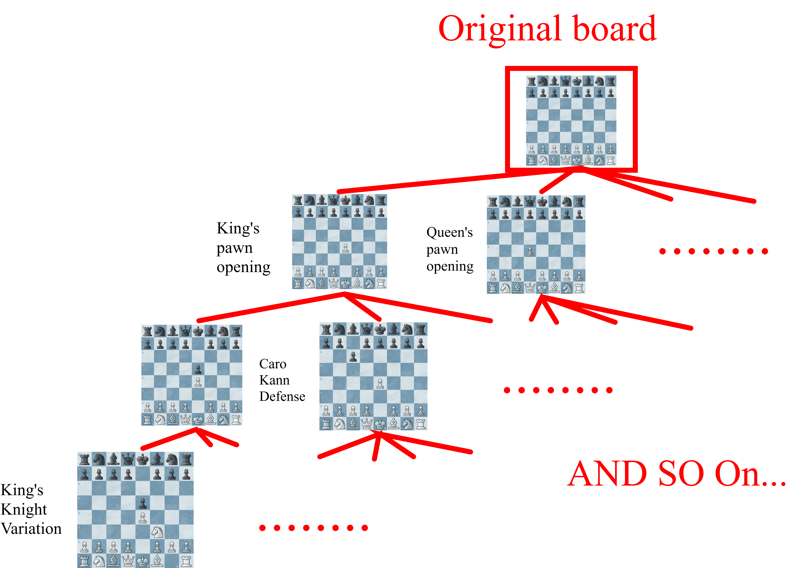

# Search

## Describe in One Sentence

Search is the process of looking ahead at possible moves and replies to find the move that gives the engine the best result.

---

## Introduction

> Please read [Chess Engine](./engine_introduce.md), [Move Generator](./movegen.md), and [Make and Undo Moves](./make_undo_move.md) first before continuing.

A chess engine cannot choose a move only by looking at the current position.
A move may win a queen immediately, but lose the king one move later.
Therefore, the engine must also consider the opponent's replies and its own responses to those replies.

The search process is basically:

1. Generate all legal moves.
2. Make one move.
3. Generate the opponent's replies.
4. Continue until the target depth is reached.
5. Evaluate the final positions.
6. Undo the moves and return the best score.

These possible continuations form a **search tree**:



The current position is the **root**. Each move creates a new **child node**, and positions at the end of the search are called **leaf nodes**.

If an engine searches to depth 4, it normally looks ahead 4 plies. A ply means one move by one side, so 4 plies are two moves by White and two moves by Black.

---

## Constant-Sum Game

Chess is a **two-player, zero-sum game**. Zero-sum is a special kind of constant-sum game.

This means one player's advantage is the other player's disadvantage. If a position has a score of `+5` from White's point of view, the same position has a score of `-5` from Black's point of view.

We can write this as:

$$
Score_{white} = -Score_{black}
$$

A simple scoring system for a finished game may be:

| Result | White's Score | Black's Score |
| --- | ---: | ---: |
| White wins | +1 | -1 |
| Draw | 0 | 0 |
| Black wins | -1 | +1 |

Real chess engines usually use larger values for positions that are not finished. For example, winning a pawn may be evaluated as about `+100` centipawns. Checkmate is represented by a much larger value.

::: tip centipawns

In chess, a pawn is usually evaluated as 1 point.

Thus, `+1` centipawn means an advantage evaluated as about one hundredth of a pawn. Just like centimeters and meters.

:::

Because both players have opposite goals, the engine cannot assume that the opponent will cooperate. It must assume that the opponent always chooses the strongest reply.

This idea leads to **Minimax**.

---

## Minimax

Minimax models two players:

- **Max** tries to make the score as large as possible.
- **Min** tries to make the score as small as possible.

Suppose White is Max and Black is Min.

```text
                    White (Max)
                   /           \
              Move A           Move B
              /   \             /   \
             3     5           2     9
          Black chooses      Black chooses
                3                  2
```

For Move A, Black can force the score down to `3`.
For Move B, Black can force the score down to `2`.
White therefore chooses Move A, because `3` is better than `2`.

Notice that White does not choose the leaf with score `9`. Black would never allow that result when Black can choose `2` instead.

A simplified Minimax function looks like this:

```text
minimax(position, depth, maximizingPlayer):
    if depth == 0 or game is over:
        return evaluate(position)

    if maximizingPlayer:
        bestScore = -infinity

        for each legal move:
            make move
            score = minimax(position, depth - 1, false)
            undo move
            bestScore = max(bestScore, score)

        return bestScore

    else:
        bestScore = +infinity

        for each legal move:
            make move
            score = minimax(position, depth - 1, true)
            undo move
            bestScore = min(bestScore, score)

        return bestScore
```

Minimax is correct if the move generator and evaluation are correct. However, writing separate maximizing and minimizing logic is unnecessary in a zero-sum game.

We can simplify it with **Negamax**.

---

## Negamax

Negamax uses the fact that:

$$
max(a, b) = -min(-a, -b)
$$

Instead of treating White as Max and Black as Min, Negamax always searches for the best score for the **side to move**.

After making a move, it becomes the opponent's turn. The opponent's score is viewed from the opposite perspective, so the returned score must be negated:

```text
score = -negamax(childPosition)
```

A simplified Negamax function looks like this:

```text
negamax(position, depth):
    if depth == 0 or game is over:
        return evaluateForSideToMove(position)

    bestScore = -infinity

    for each legal move:
        make move
        score = -negamax(position, depth - 1)
        undo move
        bestScore = max(bestScore, score)

    return bestScore
```

Negamax and Minimax produce the same result. Negamax is commonly used because its implementation is shorter and uses the same logic for both sides.

However, both algorithms still have the same major problem: they search far too many positions.

If there are about 35 legal moves in each position, searching 6 plies may require roughly:

$$
35^6 = 1,838,265,625
$$

This is why chess engines need a way to skip branches that cannot affect the final result.

---

## Alpha-Beta Search

Alpha-beta search is an optimization of Minimax or Negamax. It returns the same best move, but avoids searching branches that are already known to be useless.

It keeps two bounds:

- **Alpha ($\alpha$)** is the best score the current side can already guarantee.
- **Beta ($\beta$)** is the score the opponent can already prevent us from exceeding.

When alpha becomes greater than or equal to beta, the remaining moves in that branch do not need to be searched:

$$
\alpha \ge \beta
$$

This is called a **beta cutoff**.

### A Simple Example

Suppose White has already found a move that guarantees a score of `3`.
This means alpha is now `3`.

While checking another move, the engine finds that Black has a reply that limits White's score to `2`. White would never choose this branch, because it already has a move scoring `3`.

Therefore, the engine can stop searching the remaining replies in that branch. They cannot change White's final decision.

### Negamax with Alpha-Beta Pruning

```text
negamax(position, depth, alpha, beta):
    if depth == 0 or game is over:
        return evaluateForSideToMove(position)

    bestScore = -infinity

    for each legal move:
        make move
        score = -negamax(position, depth - 1, -beta, -alpha)
        undo move

        bestScore = max(bestScore, score)
        alpha = max(alpha, score)

        if alpha >= beta:
            break

    return bestScore
```

The child receives `-beta` and `-alpha` because the point of view changes after every move.

At the root, the search can be started with the widest possible window:

```text
score = negamax(position, depth, -infinity, +infinity)
```

### Move Ordering

Alpha-beta search is most effective when strong moves are searched first.

If a good move raises alpha early, more later branches can be cut off. If weak moves are searched first, the engine may still get the correct answer, but it will search many more nodes.

Common move-ordering ideas include:

- Searching the best move from the previous search first
- Searching promising captures first
- Searching promotions and checking moves early
- Remembering moves that caused cutoffs in similar positions

In the best case, alpha-beta pruning can allow an engine to search roughly twice as deeply as plain Minimax with the same amount of work. The actual improvement depends heavily on move ordering.

---

## Search Depth and Evaluation

The engine cannot normally search until the game ends, so it stops at a chosen depth and calls an **evaluation function**.

The evaluation function estimates how good the leaf position is by considering information such as:

- Material
- Piece activity
- King safety
- Pawn structure
- Space and mobility

Search and evaluation work together. Search predicts what may happen, while evaluation gives a score to the positions where the prediction stops.

A deeper search is usually more accurate, but it also takes more time. Practical engines therefore use techniques such as iterative deepening, transposition tables, quiescence search, and many other pruning methods on top of alpha-beta search.

---

## Summary

Search allows a chess engine to compare moves while assuming that the opponent will always play the best reply.

The main ideas are:

- Chess is a zero-sum game, so one side's advantage is the other side's disadvantage.
- Minimax alternates between maximizing and minimizing the score.
- Negamax expresses the same idea with one shorter recursive function.
- Alpha-beta search skips branches that cannot change the result.
- Good move ordering creates more cutoffs and makes the search much faster.

In short:

```text
Generate moves, search replies, evaluate leaves, and choose the best result.
```
